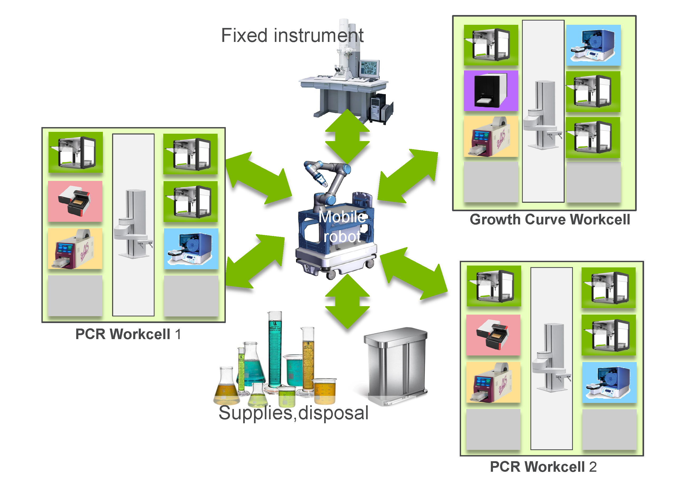
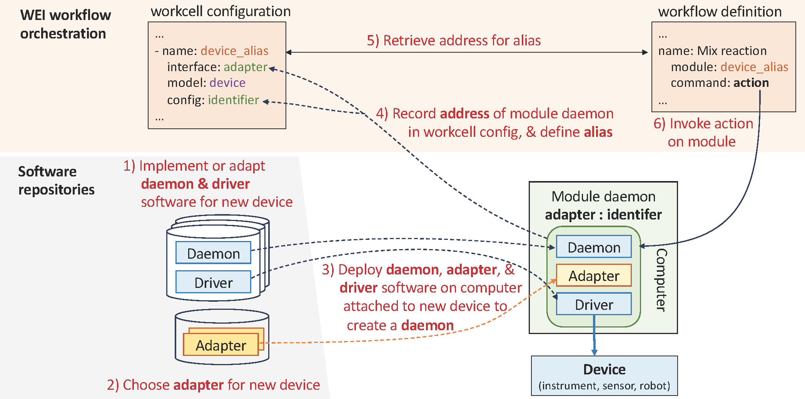

# Towards a Modular Architecture for Science Factories
## Accelerate 2023

- [[Website]](https://pubs.rsc.org/en/content/articlelanding/2023/dd/d3dd00142chttps://ad-sdl.github.io/wei2023/)
- [[arXiv]](https://arxiv.org/abs/2308.09793)
- [[PDF]](https://pubs.rsc.org/en/content/articlepdf/2023/dd/d3dd00142c)

## Abstract

Advances in robotic automation, high-performance computing (HPC), and artificial intelligence (AI) encourage us to conceive of science factories: large, general-purpose computation- and AI-enabled self-driving laboratories (SDLs) with the generality and scale needed both to tackle large discovery problems and to support thousands of scientists. Science factories require modular hardware and software that can be replicated for scale and (re)configured to support many applications. To this end, we propose a prototype modular science factory architecture in which reconfigurable modules encapsulating scientific instruments are linked with manipulators to form workcells, that can themselves be combined to form larger assemblages, and linked with distributed computing for simulation, AI model training and inference, and related tasks. Workflows that perform sets of actions on modules can be specified, and various applications, comprising workflows plus associated computational and data manipulation steps, can be run concurrently. We report on our experiences prototyping this architecture and applying it in experiments involving 15 different robotic apparatus, five applications (one in education, two in biology, two in materials), and a variety of workflows, across four laboratories. We describe the reuse of modules, workcells, and workflows in different applications, the migration of applications between workcells, and the use of digital twins, and suggest directions for future work aimed at yet more generality and scalability. Code and data are available at https://ad-sdl.github.io/wei2023 and in the ESI.



*Figure 1: An example of how our framework can connect multiple workcells*
\
\

*Figure 2: A diagram of the layout of our software infrastructure and all of its components*

## Installation

To install and use WEI as implemented in this paper, follow the steps below. To use the latest version of WEI, consult [the WEI repository](https://github.com/AD-SDL/wei)

 1. `git clone --branch v0.3.4 https://github.com/AD-SDL/wei.git ~/workspace/wei`
 3. Within `~/workspace/wei` run the following code block:

```
conda create -n rpl-wei python=3.9
conda activate rpl-wei
pip3 install --upgrade pip setuptools wheel
pip3 install -r requirements/dev.txt
pip3 install -r requirements/requirements.txt
pip3 install -e .
```

# Demo

In a linux terminal, go to `~/workspace/wei/examples`. from within the folder run `./run_wei_server.sh`. in a new terminal tab in the same folder, run `./run_example.py`. This will show a text-only simulation of the workflow execution

# Paper and Citation

Our paper is posted on [arXiv](https://arxiv.org/abs/2308.09793), and in the [Digital Discovery Journal](https://pubs.rsc.org/en/content/articlelanding/2023/dd/d3dd00142c). If you find our work useful, please consider citing us!

```bibtex
@Article{D3DD00142C,
author ="Vescovi, Rafael and Ginsburg, Tobias and Hippe, Kyle and Ozgulbas, Doga and Stone, Casey and Stroka, Abraham and Butler, Rory and Blaiszik, Ben and Brettin, Tom and Chard, Kyle and Hereld, Mark and Ramanathan, Arvind and Stevens, Rick and Vriza, Aikaterini and Xu, Jie and Zhang, Qingteng and Foster, Ian",
title  ="Towards a modular architecture for science factories",
journal  ="Digital Discovery",
year  ="2023",
pages  ="-",
publisher  ="RSC",
doi  ="10.1039/D3DD00142C",
url  ="http://dx.doi.org/10.1039/D3DD00142C",
abstract  ="Advances in robotic automation{,} high-performance computing (HPC){,} and artificial intelligence (AI) encourage us to conceive of science factories: large{,} general-purpose computation- and AI-enabled self-driving laboratories (SDLs) with the generality and scale needed both to tackle large discovery problems and to support thousands of scientists. Science factories require modular hardware and software that can be replicated for scale and (re)configured to support many applications. To this end{,} we propose a prototype modular science factory architecture in which reconfigurable modules encapsulating scientific instruments are linked with manipulators to form workcells{,} that can themselves be combined to form larger assemblages{,} and linked with distributed computing for simulation{,} AI model training and inference{,} and related tasks. Workflows that perform sets of actions on modules can be specified{,} and various applications{,} comprising workflows plus associated computational and data manipulation steps{,} can be run concurrently. We report on our experiences prototyping this architecture and applying it in experiments involving 15 different robotic apparatus{,} five applications (one in education{,} two in biology{,} two in materials){,} and a variety of workflows{,} across four laboratories. We describe the reuse of modules{,} workcells{,} and workflows in different applications{,} the migration of applications between workcells{,} and the use of digital twins{,} and suggest directions for future work aimed at yet more generality and scalability. Code and data are available at https://ad-sdl.github.io/wei2023 and in the ESI."}
```
